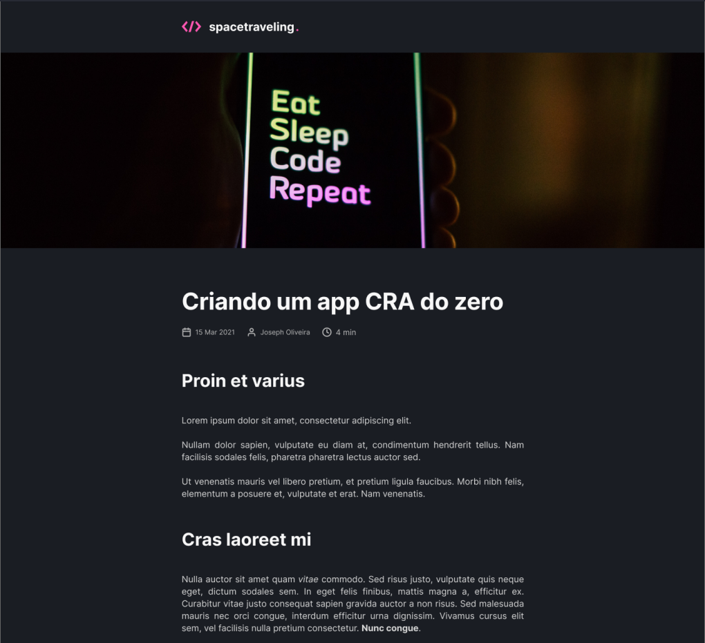

  

<h4 align="center">
  🚀 spacetraveling
</h4>

 

  <!--  -->

  <a href="#computer-tecnologias">Tecnologias</a>&nbsp;&nbsp;&nbsp;|&nbsp;&nbsp;&nbsp;
  <a href="#gear-projeto">Projeto</a>&nbsp;&nbsp;&nbsp;|&nbsp;&nbsp;&nbsp;
  <a href="#layout">Layout</a>&nbsp;&nbsp;&nbsp;|&nbsp;&nbsp;&nbsp;
  <a href="#thinking-como-contribuir">Como contribuir</a>&nbsp;&nbsp;&nbsp;

 

## :computer: Tecnologias

Esse projeto foi desenvolvido com as seguintes tecnologias:

- [React Js](https://reactjs.org)
- [Next Js](https://nextjs.org)
- [Prismic CMS](https://prismic.io/)

## :gear: Projeto
Esse projeto foi dado como um desafio no capítulo III do curso ignite da trilha ReactJS da [Rocketseat](https://rocketseat.com.br/) onde o objetvo era construir um blog com [Next Js](https://nextjs.org) e [Prismic CMS](https://prismic.io/) tendo como base uma interface previamente construída no Figma.

## Layout

  
 

## :thinking: Como contribuir

- Faça um fork desse repositório;
- Cria uma branch com a sua feature: `git checkout -b minha-feature`;
- Faça commit das suas alterações: `git commit -m 'feat: Minha nova feature'`;
- Faça push para a sua branch: `git push origin minha-feature`.

Depois que o merge da sua pull request for feito, você pode deletar a sua branch.

Feito com ♥ by Gabriel Camargo :wave:
